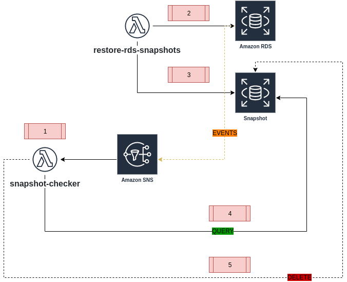

## Description

### To test locally

`virtualenv venv --python=python3`

`source venv/bin/activate`

`pip install boto3`

### To create the requiriments.txt so tha you can package your lambda

`pip freeze > requirements.txt`

### To Deploy

you need to pull the image: `lambci/lambda:build-python3.7`

`npm install --save serverless-python-requirements`

#### References
https://serverless.com/blog/serverless-python-packaging/

https://github.com/jkehler/awslambda-psycopg2

https://stackoverflow.com/questions/52648986/conn-configuration-for-aws-lambda-python-rds-postgres-iam-authentication

https://aws.amazon.com/blogs/database/iam-role-based-authentication-to-amazon-aurora-from-serverless-applications/

https://www.periscopedata.com/blog/exact-row-counts-for-every-database-table

https://gist.github.com/hugorodgerbrown/5084022